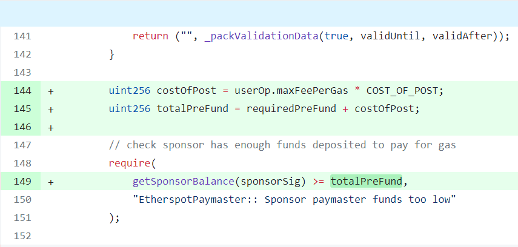

# erc4337-account-abstraction
An assignment based on the ERC-4337 standard for Account Abstraction.

## ** Addition
While solving this task, it was fun and satisfying to find a bug that was correct.  
I commented on the [Etherspot paymaster contract commit (line146)](https://github.com/etherspot/etherspot-prime-contracts/commit/d2436775bf9886ec82a7389a005f37911193ae68#diff-963e97cb51ce48ba7288b63b2d68e85c94f966a351428009226aab6ecfaa5bf9) and asked the creator if there is a bug: 


### **And indeed he fixed it in this [last commit](https://github.com/etherspot/etherspot-prime-contracts/commit/8f548ca9fc28109706a2bb938207315c8db3af67) :)**





# Full Stack Web3 Engineer Challenge

## Introduction

This assignment is designed to assess your understanding and skills in deploying smart contracts, running backend services, and developing a contract and a backend that will work with an existing system. The main task will be based on the ERC-4337 standard for Account Abstraction.

Account Abstraction is a proposal for a new Ethereum standard that aims to improve the user experience by allowing users to pay gas fees in tokens other than Ether, among other benefits. It introduces a new transaction type called "user operations" that are sponsored by a third party, known as a "paymaster".

For more detailed information about the ERC-4337 standard, please refer to the following resources:

- [ERC-4337 Official Website](https://www.erc4337.io/)
- [Alchemy Blog: Account Abstraction](https://www.alchemy.com/blog/account-abstraction)
- [Alchemy Learn: Account Abstraction](https://www.alchemy.com/learn/account-abstraction)

## Assignment Tasks

### Task 0: Understanding the Components

Please take a moment to familiarize yourself with the following components. You will be using them in the subsequent tasks. 

- Skandha bundler by Etherspot: [GitHub Link](https://github.com/etherspot/skandha)
- Userop.js by Stackup as the client library: [GitHub Link](https://github.com/stackup-wallet/userop.js)
- ERC-4337-Examples by Stackup that utilises the userop.js library: [GitHub Link](https://github.com/stackup-wallet/erc-4337-examples)
- Entrypoint contract which is already deployed on Fuse Spark network: [Fuse Spark Link](https://explorer.fusespark.io/address/0x5FF137D4b0FDCD49DcA30c7CF57E578a026d2789)

### Task 1: Running the Skandha Bundler

Run the Skandha Bundler on Fuse Spark network. You can find the Spark network details [here](https://docs.fuse.io/docs/basics/getting-started-with-fuse/network-details#fuse-spark-testnet-chainid-123).

Please make sure that your `config.json` file looks like this:

```json
"networks": {
	"fuseSparknet": {
	      "entryPoints": [
	        "0x5FF137D4b0FDCD49DcA30c7CF57E578a026d2789"
	      ],
	      "relayer": "RELAYER_PRIVATE_KEY",
	      "beneficiary": "BENEFICIARY_ADDRESS",
	      "rpcEndpoint": "https://bundler.rpc.fusespark.io/",
	      "minInclusionDenominator": 10,
	      "throttlingSlack": 10,
	      "banSlack": 10
	    }
}
```

Also please make sure that you run the Skandha bundler with the flags `--unsafeMode` and `--redirectRpc`. If you’re interested you can check what those flags mean by running `./skandha --help`.

<aside>
💡 You will need some native Fuse tokens on Spark network for your relayer address.  

You can get some from [here](https://get.fusespark.io).

</aside>

### Task 2: Deploying and Verifying Contracts

Deploy the Zerodev’s kernel factory to Spark testnet and verify the contracts. You can find the kernel factory here: [GitHub Link](https://github.com/zerodevapp/kernel)

Please provide the following:

- The transaction hash of the deployment
- The contract address of the deployed contract
- A brief explanation of the steps you took to deploy and verify the contract

### Task 3: Submitting Transactions

Submit successful transactions through the kernel examples in erc-4337-examples in stackup’s repository.

The examples repository allows you to create a counterfactual address for a Kernel wallet contract and then submit transactions with it. 

You should submit the following transactions successfully:

- Deployment of a Kernel Wallet (note that for the first transaction, the user operation will include an `initCode` which will let Entrypoint contract know that it needs to be deployed. Since we are not using a Paymaster yet, the address that you generated counterfactually should have some native Fuse tokens to pay for the gas fees).
- A native Fuse transfer to another address
- An ERC20 token transfer to another address
- A batch transaction with one native Fuse transfer and one ERC20 token transfer

Please provide the following:

- The transaction hashes of your successful transactions
- Screenshots or other evidence of the successful transactions
- A brief explanation of the steps you took to submit the transactions

### Task 4: Implementing a Paymaster RPC Service

Congratulations on completing all previous tasks!

For the final challenge, you will need to implement a Paymaster RPC Service that creates the `paymasterAndData` signed by the Paymaster RPC Service's signer and added to the user operation sent by the client. This user operation object should be sponsored by the paymaster.

The Paymaster RPC Service's role is to prepare the `paymasterAndData` field that will be attached to the user operation object. In order to prepare this new field, the service needs to communicate with a Paymaster contract on the blockchain to get the hashed data that the service's signer will sign. 

This task is divided into the following three parts:

#### Part 1: The Paymaster Contract

For the first part of this task, you will need to modify the [EtherspotPaymaster contract](https://github.com/etherspot/etherspot-prime-contracts/blob/master/src/paymaster/EtherspotPaymaster.sol).

Note that the contract has a whitelisting logic that we don't need at the moment, so you will need to remove the whitelisting logic completely from the contract.

In addition, note that there is a mapping of addresses to balances stored in a `sponsorFunds` variable in the contract. This means that each "sponsor address" needs to run on a backend and needs to sign the `paymasterAndData` that will be attached to the user operation. Since we want to keep the developer experience simple, we want to have a single verifying signer in this contract. For this, we need to have an address that is the verifying signer which can be later changed by only the owner of the contract. This verifying signer address will be the one that will sign the `paymasterAndData` and when the paymaster contract receives a user operation with a `paymasterAndData` it will need to verify that its verifying signer address signed it. 

However, when we make the above modification, there is an additional change we need to do. Note that in the original contract, the `paymasterAndData` doesn’t include any information about the sponsor address, but the sponsor address is extracted from the signer of the signature field within the `paymasterAndData`. Therefore, we will need to add an additional field to the `paymasterAndData`, namely the `sponsorAddress`. Please make sure that all of the necessary functions in the contract are modified according to this logical change.

#### Part 2: The Paymaster RPC Service

For the second part of this task, you are asked to create a Paymaster RPC service, preferably written in JavaScript/TypeScript or Python. This service will receive the RPC requests to the ****`pm_sponsorUserOperation`**** method with the user operation, and the service will return the `paymasterAndData` along with other necessary information such as updated gas information. 

For more information about the specs that the Paymaster RPC Service please refer to: https://hackmd.io/@stackup/H1oIvV-qi (Note: for the purpose of this task you can ignore the ****`pm_accounts`** method).

#### Part 3: Running the Examples

When you have the Paymaster RPC Service up and running, in the example scripts of Stackup you should add the following to the `config.json` file:

```json
"paymaster": {
    "rpcUrl": "http://localhost:3000/json-rpc",
    "context": {}
  }
```

Then when you run the example scripts with the flag `--pm` it should send a request to the Paymaster RPC Service in order to get the necessary information to be appended to the user operation before it’s sent to the bundler. 

When you achieve running a successful transaction with a Paymaster, you should see that the smart contract account can be deployed or send transactions without having any Native Fuse balance (or even if it has, the native Fuse balance doesn’t change due to transaction fees), because the Paymaster covers the transaction fees. 

Please provide the following:

- The code for your Paymaster contract and RPC service
- The address of the deployed Paymaster contract (preferably verified so the code can be seen on the explorer)
- Screenshots or other evidence of the successful creation of the Paymaster
- A brief explanation of the steps you took to implement the Paymaster contract and the RPC service, any challenges you encountered, as well as any recommendations you have to improve the design and/or implementation
- A successful transaction with a Paymaster that sponsors gas fees for a user operation.

## **Support and Questions**

Should you have any queries

or require clarification during the assignment, please do not hesitate to contact us at fuse.io. We are more than willing to provide support and guidance through any challenges encountered.

## **Deadline**

Ensure to submit your completed assignment, including all source code and relevant documentation, within a period of 7 days. Your prompt completion of the assignment aids us in assessing your work and progressing with the recruitment process.

Please remember that adherence to the deadline is critical for this assignment, and late submissions may affect our evaluation of your candidacy. Should you anticipate any challenges or require an extension, please inform us ahead of time to facilitate the necessary arrangements.

## Submission

Please submit your completed assignment by the due date. Include all relevant code, deployment details, and a brief explanation of your approach and any challenges you encountered.

Good luck

We look forward to reviewing your submission!
