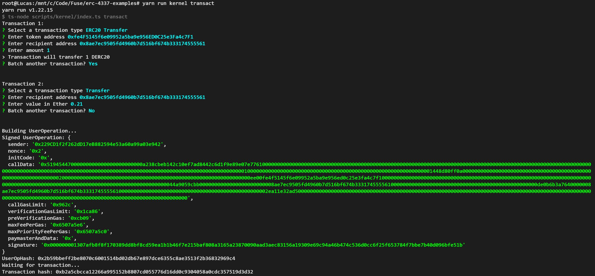

## 1. Transaction: Deployment of a Kernel Wallet + A native token transfer to another address: 
[Transaction hash on Polygon Mumbai explorer polygonscan: 0x04f9b49261b0146dac186132145c614040f6251ecad0838f06eb0da0dbf04087](https://mumbai.polygonscan.com/tx/0x04f9b49261b0146dac186132145c614040f6251ecad0838f06eb0da0dbf04087)
Link to transaction on JiffyScan to see UserOp: [here](https://app.jiffyscan.xyz/bundle/0x04f9b49261b0146dac186132145c614040f6251ecad0838f06eb0da0dbf04087?network=mumbai&pageNo=0&pageSize=10).  
Successful screenshot: 


#### Brief explanation:
Following the [kernel wallet example tutorial](https://docs.stackup.sh/docs/erc-4337-examples-zerodev-kernel) related to this [Github repo](https://github.com/stackup-wallet/erc-4337-examples):
1.  Running:
    ```
    yarn run kernel address 
    ```
    on Polygon Mumbai with Stackup API node URL, returns a counterfactual address for the private key.  

2. Running:
    ```
    yarn run kernel transact
    ```
    and then CLI select transfer.
    
    First it errored on "AA40 over verificationGasLimit"
    I tried to increase verificationGasLimit field, but signature would not fit anymore.  
    So I used a workaround code snippet from Stackup's devs Discord to increase the verificationGasLimit:
    ```
      kernel
        // Buffer
        .useMiddleware(async (ctx) => {
          ctx.op.verificationGasLimit = ethers.BigNumber.from(
            ctx.op.verificationGasLimit
          ).mul(2);
        })
        // Resign
        .useMiddleware(
          Presets.Middleware.EOASignature(new ethers.Wallet(config.signingKey))
        )
        // Apply Kernel Sudo mode
        .useMiddleware(async (ctx) => {
          ctx.op.signature = ethers.utils.hexConcat([
            Constants.Kernel.Modes.Sudo,
            ctx.op.signature,
          ]);
        });
    ```
    And then the transaction worked.

## 2. Transaction: ERC20 token transfer to another address:
[Transaction hash on Polygon Mumbai explorer polygonscan: 0x37b961623308e7160c1599fe7fbb3c188423d4eead06b3d7bfcdf521c783ffbe](https://mumbai.polygonscan.com/tx/0x37b961623308e7160c1599fe7fbb3c188423d4eead06b3d7bfcdf521c783ffbe)
Link to transaction on JiffyScan to see UserOp: [here](https://app.jiffyscan.xyz/bundle/0x37b961623308e7160c1599fe7fbb3c188423d4eead06b3d7bfcdf521c783ffbe?network=mumbai&pageNo=0&pageSize=10).  
Successful screenshot: 

#### Brief explanation:
1. Collect dummy ERC20 token from [Polygon Faucet](https://faucet.polygon.technology/)
2. Same CLI command ```yarn run kernel transact``` followed by ERC20 transfer, token address, and amount.

## 3. Batch Transaction: 1 native token transfer + 1 ERC20 token transfer
[Transaction hash on Polygon Mumbai explorer polygonscan: 0xb2a5cbcca12266a995152b8807cd055776d16dd0c9304058a0cdc357519d3d32](https://mumbai.polygonscan.com/tx/0xb2a5cbcca12266a995152b8807cd055776d16dd0c9304058a0cdc357519d3d32)
Link to transaction on JiffyScan to see UserOp: [here](https://app.jiffyscan.xyz/bundle/0xb2a5cbcca12266a995152b8807cd055776d16dd0c9304058a0cdc357519d3d32?network=mumbai&pageNo=0&pageSize=10).  
Successful screenshot: 

#### Brief explanation:
1. Same as first and second, just combined through the CLI.


